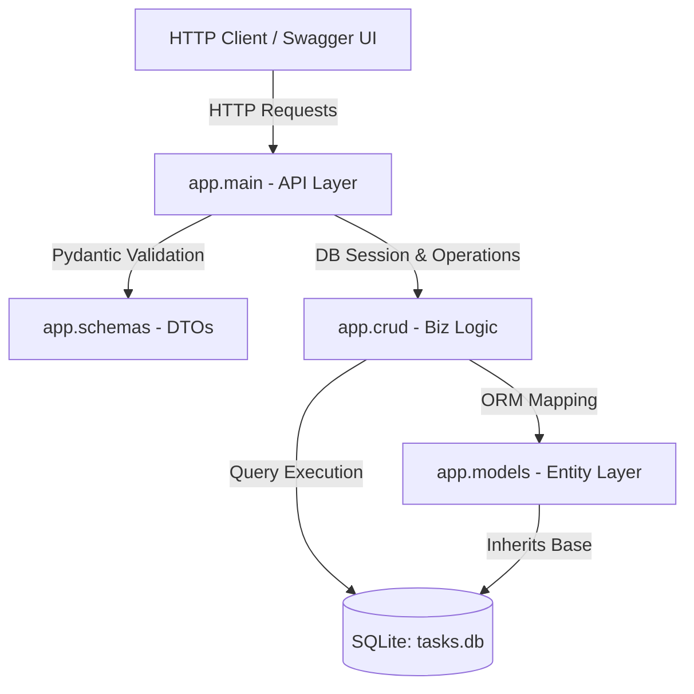

# Design: RESTful Task Management API

## 架构概览
本系统采用分层架构（Layered Architecture）实现任务管理 Web 服务，分为三层：
1. **API 层（Router & Entrypoint）**：基于 FastAPI 框架，负责路由分发、请求体/查询参数的反序列化、全局异常拦截与标准 JSON 响应的序列化返回。
2. **业务逻辑与 CRUD 层（Service & CRUD）**：封装核心数据库操作，基于 SQLAlchemy 编写安全、无注入风险的 SQL 逻辑，包括多条件动态拼接查询、排序与分页计算。
3. **数据访问与建模层（Data Layer）**：由 SQLAlchemy 模型定义数据库表结构，管理 SQLite 数据库连接及会话声明周期。

## 模块划分

### Module 1: 应用入口与接口层 (`app/main.py`)
- **职责**：初始化 FastAPI 应用，设置路由前缀 `/api/v1`，配置跨域中间件，注册全局异常处理器（统一捕获校验异常与未找到资源异常），并管理服务启动时的数据库表自动建表。
- **接口**：
  - `POST /api/v1/tasks`：创建任务接口。
  - `GET /api/v1/tasks/{id}`：获取单个任务详情。
  - `PUT /api/v1/tasks/{id}`：更新单个任务。
  - `DELETE /api/v1/tasks/{id}`：删除单个任务（物理删除）。
  - `GET /api/v1/tasks`：支持过滤、分页、排序的列表查询接口。

### Module 2: 数据库底座与配置层 (`app/database.py`, `app/config.py`)
- **职责**：维护 SQLite 物理库的连接参数，生成 SQLAlchemy `engine`，声明数据库会话工厂 `SessionLocal` 以及基类 `Base`，通过 Dependency Injection 机制向接口提供 scoped 级别的数据库会话生成器 `get_db`。
- **接口**：
  - `get_db() -> Generator`：数据库连接上下文管理器，请求结束自动 Close。
  - `init_db() -> None`：服务启动时触发创建所有实体表。

### Module 3: 实体映射层 (`app/models.py`)
- **职责**：基于 SQLAlchemy 声明式映射，定义数据库在 SQLite 中的物理表字段及数据约束。
- **接口**：
  - `Task(Base)` 实体类：定义 `id`、`title`、`description`、`status`、`priority`、`created_at`、`updated_at` 字段。

### Module 4: 数据传输与校验层 (`app/schemas.py`)
- **职责**：使用 Pydantic v2 模型，声明客户端请求的 Body、Query 参数的类型规则、长度限制、枚举约束。过滤敏感信息并输出标准响应体（DTO）。
- **接口**：
  - `TaskCreate`：校验标题非空且长度 <= 100，规范 `status` 和 `priority` 只能为合法枚举。
  - `TaskUpdate`：支持部分字段更新的校验模型。
  - `TaskResponse`：出参序列化模型，将模型实例转化为规范的 JSON 输出。
  - `TaskListResponse`：分页封装出参模型，带有 `total`（匹配总数）、`skip`、`limit` 以及 `items` 列表。

### Module 5: 数据持久化与逻辑层 (`app/crud.py`)
- **职责**：承接 API 层调用的业务操作，通过 SQLAlchemy 动态构造 Query，处理复杂的分页偏移量、降序升序排列、以及按优先级/状态/时间区间的联合过滤。
- **接口**：
  - `create_task(db: Session, task: TaskCreate) -> Task`
  - `get_task_by_id(db: Session, task_id: int) -> Optional[Task]`
  - `get_tasks_paginated(db: Session, ...) -> Tuple[List[Task], int]`
  - `update_task(db: Session, db_task: Task, task_in: TaskUpdate) -> Task`
  - `delete_task_by_id(db: Session, db_task: Task) -> None`

## 数据模型
本系统采用单表存储任务，表名为 `tasks`。其详细数据结构定义如下：

| 字段名称 | 物理类型 | 约束条件 | 默认值 | 业务含义 |
| :--- | :--- | :--- | :--- | :--- |
| **id** | INTEGER | Primary Key, Autoincrement | 无 | 任务唯一标识（自增 ID） |
| **title** | VARCHAR(100) | NOT NULL, 1-100 字符 | 无 | 任务标题 |
| **description** | TEXT | Nullable | NULL | 任务详细描述 |
| **status** | VARCHAR(20) | NOT NULL, 约束为 'todo', 'in_progress', 'done' | 'todo' | 任务所处生命周期状态 |
| **priority** | VARCHAR(20) | NOT NULL, 约束为 'low', 'medium', 'high' | 'medium' | 任务紧急/重要程度 |
| **created_at** | DATETIME | NOT NULL | CURRENT_TIMESTAMP | 任务创建时间 |
| **updated_at** | DATETIME | NOT NULL, 触发更新时修改 | CURRENT_TIMESTAMP | 任务最后一次修改时间 |

## 技术选型说明

- **选择 Python (FastAPI) 而不是 Node.js (Express)**：
  - **原生类型校验与健壮性**：FastAPI 通过 Python 类型提示（Type Hints）与 Pydantic 的深度融合，实现了端到端的数据强校验。开发人员只需定义一次 Pydantic 模型，系统就能自动拒绝非法入参，免去了 Express 中需手动书写 Joi/Zod 校验和拦截中间件的冗余步骤。
  - **自动生成契约文档**：FastAPI 会根据 Pydantic 模型和路由定义，**零额外代码**自动生成标准 OpenAPI (Swagger UI) 文档。相比 Express 中容易过时、维护痛苦的 Swagger JSDoc 注释，FastAPI 保证了“代码即文档”的极致体验。
  - **异步性能表现**：FastAPI 支持基于 Python `async`/`await` 的 ASGI 规范，对于高并发的 I/O 密集型 API 服务，能够展现出和 Node.js 一样出色的并发性能。
- **选择 SQLAlchemy ORM 而不是 原生 SQL**：
  - **防 SQL 注入**：SQLAlchemy 默认使用参数化查询，从根本上杜绝了字符串拼接引发的 SQL 注入风险。
  - **环境解耦与极速测试**：在开发期我们使用物理 SQLite (`tasks.db`)。而在测试运行期，由于使用了 ORM 抽象，我们可以**零代码修改**直接无缝切换为 `:memory:` 内存 SQLite 数据库，极大提升了集成测试的执行速度和数据环境隔离度。
- **SQLite 仿真/模拟说明**：
  - 本项目为纯软件实现课题。数据库采用 SQLite，其数据存储在项目本地文件 `tasks.db` 中。在运行期通过 SQLAlchemy 库进行本地驱动加载，无需安装繁重的 PostgreSQL 或 MySQL 服务，做到即开即用、零外部依赖。
